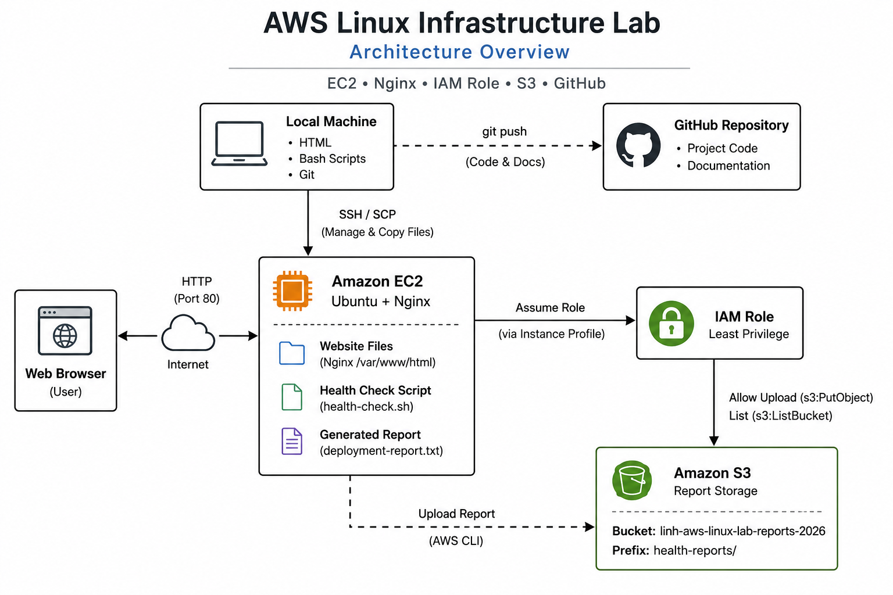

# AWS Linux Infrastructure Lab

A hands-on cloud infrastructure project demonstrating Linux administration, Amazon EC2, Nginx, IAM roles, Amazon S3, Bash scripting, and Git version control.

---

## Project Goal

Build and document a Linux-based web server on AWS while practicing fundamental cloud engineering skills, including secure authentication, web server deployment, Bash scripting, and technical documentation.

---

## Architecture



---

## Technologies

- Amazon EC2
- Ubuntu Linux
- Nginx
- AWS IAM
- Amazon S3
- AWS CLI
- Bash
- Git
- GitHub

---

## Skills Demonstrated

- Linux command-line administration
- EC2 provisioning and management
- Nginx web server deployment
- SSH remote administration
- SCP secure file transfer
- IAM Role authentication
- Principle of Least Privilege
- Bash scripting
- AWS CLI operations
- Amazon S3 object management
- Technical documentation
- Git version control

---

## Project Workflow

1. Develop the website locally.
2. Transfer website files to Amazon EC2 using SCP.
3. Deploy the website to the Nginx web root.
4. Verify the EC2 IAM role using AWS CLI.
5. Execute a Bash health-check script.
6. Generate a deployment report.
7. Upload the report to Amazon S3.
8. Document the project and publish it to GitHub.

---

## Repository Structure

```text
aws-linux-infrastructure-lab/
│
├── README.md
│
├── architecture/
│   └── architecture-diagram.png
│
├── documentation/
│   ├── command-reference.md
│   └── troubleshooting-log.md
│
├── screenshots/
│   ├── Bash health check script.png
│   ├── EC2 launch.png
│   ├── Enhanced deployment report.png
│   ├── IAM role.png
│   ├── Initial webpage.png
│   ├── Nginx installation.png
│   ├── Report uploaded to S3 bucket.png
│   └── Security group.png
│
├── scripts/
│   └── health-check.sh
│
└── website/
    └── index.html
```

---

## Screenshots

### Initial Website


### Nginx Installation


### EC2 Launch


### Security Group Configuration


### IAM Role Verification


### Bash Health Check Script


### Generated Deployment Report


### Report Uploaded to Amazon S3


---

## Documentation

Additional project documentation:

- **command-reference.md** — Linux, AWS CLI, Git, and Bash commands used throughout the project.
- **troubleshooting-log.md** — Problems encountered during development and the solutions used to resolve them.

---

## Security

This project follows several AWS security best practices:

- EC2 authenticates using an IAM Role.
- S3 access is controlled with a least-privilege IAM policy.
- No long-term AWS access keys are stored on the EC2 instance.
- Sensitive AWS account information is redacted from screenshots.

---

## Lessons Learned

This project strengthened my understanding of:

- Linux system administration
- Deploying and managing an Nginx web server
- IAM roles and permission management
- Secure file transfer with SSH and SCP
- Bash scripting for server administration
- AWS CLI operations
- Technical documentation and Git version control

---

## Future Improvements

- Configure HTTPS using Let's Encrypt.
- Automate health-check execution with cron or systemd timers.
- Deploy infrastructure using Terraform.
- Automate deployments with GitHub Actions.
- Monitor the server using Amazon CloudWatch.
